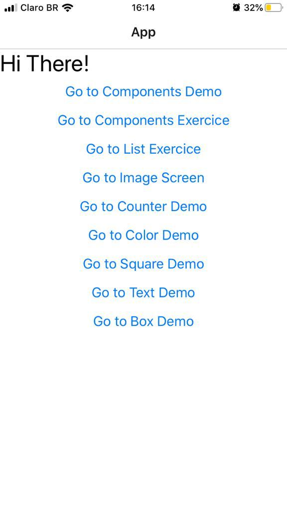

### :books: React-Native Start

  <a href="#rocket-tecnologias">Tecnologias</a>&nbsp;&nbsp;&nbsp;|&nbsp;&nbsp;&nbsp;
  <a href="#-projeto">Projeto</a>&nbsp;&nbsp;&nbsp;|&nbsp;&nbsp;&nbsp;
  <a href="#-layout">Layout</a>&nbsp;&nbsp;&nbsp;|&nbsp;&nbsp;&nbsp;

 

## :rocket: Tecnologias

Esse projeto foi desenvolvido com as seguintes tecnologias:

- [React Native](https://facebook.github.io/react-native/)
- [Expo](https://expo.io/)

## 💻 Projeto

O React-Native Start é um projeto de aprendizado desenvolvido a partir do curso [The Complete React Native + Hooks Course [2019 Edition]](https://www.udemy.com/course/the-complete-react-native-and-redux-course) que visa colocar em prática os conceitos da tecnologia em código, procurando implementar funções isoladas de cada item / conceito como forma de aprimorar o conhecimento.

## 🔖 Layout

<h1 align="center">
    
</h1>

---
